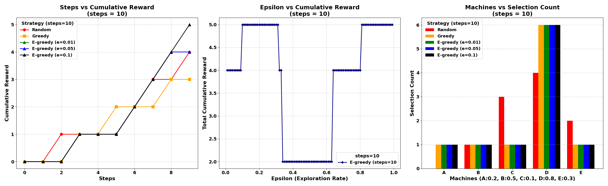
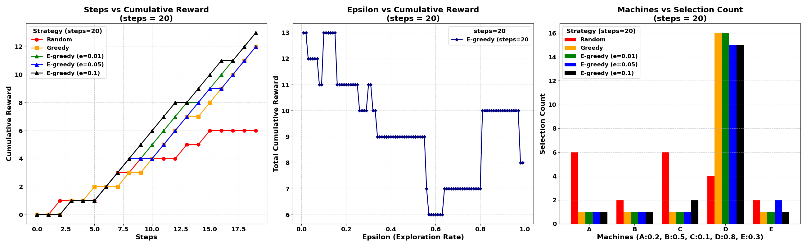
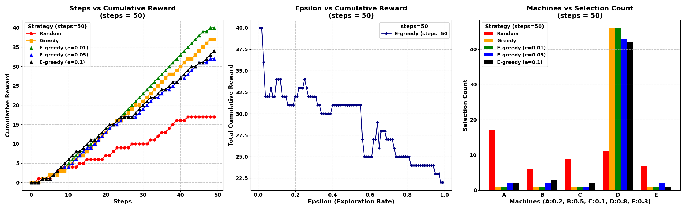
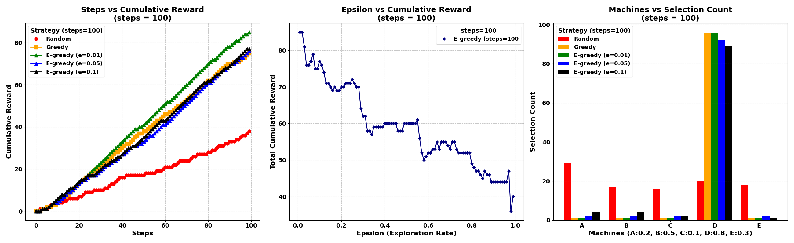
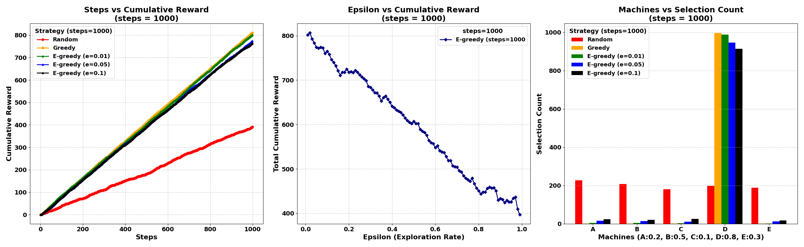
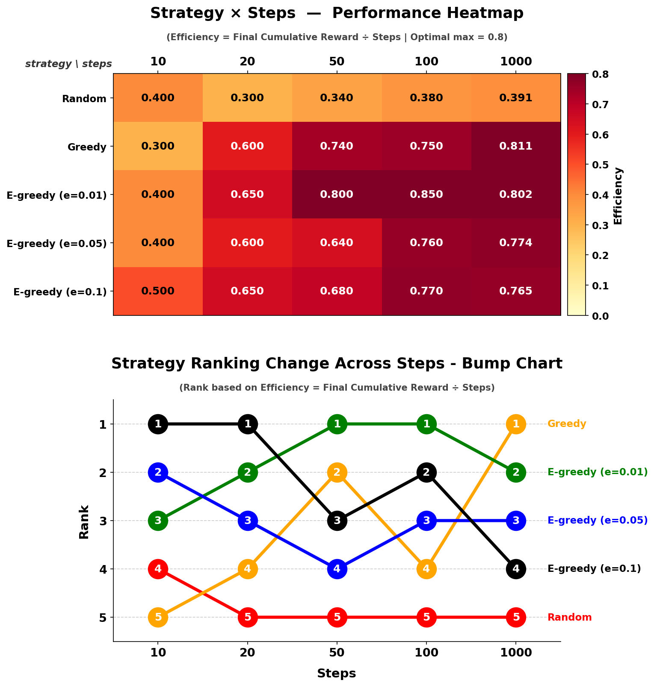

# Multi-Armed Bandit (MAB) Simulation

## KDT Team Project : 팀 Chainers 🫡

슬롯머신 5대(A~E)의 당첨 확률을 모르는 상태에서, 직접 레버를 당겨보며 누적 보상을 최대화하는 최적 머신을 찾는 **Multi-Armed Bandit(MAB)** 문제를 세 가지 전략으로 비교 실험한다.

---

### 실험 환경 및 시뮬레이션 전략

| 항목          | 내용                                                                        |
| ------------- | --------------------------------------------------------------------------- |
| **슬롯머신**  | A(0.2), B(0.5), C(0.1), D(0.8, 최적⭐), E(0.3) — 확률은 에이전트에게 비공개 |
| **보상**      | 베르누이 분포 (당첨=1, 꽝=0)                                                |
| **실험 조건** | steps = [10, 20, 50, 100, 1000] / seed=2026 / GPU(CUDA) 우선                |
| **초기 탐색** | Greedy·ε-greedy 공통: 머신당 1회씩 순차 탐색 후 전략 적용                   |

| 전략         | 작동 방식                                                               |
| ------------ | ----------------------------------------------------------------------- |
| **Random**   | 매 스텝 무작위 선택 — 학습 없음, 기준선(Baseline) 역할                  |
| **Greedy**   | 초기 탐색 후 Q값(추정 평균 보상)이 가장 높은 머신만 고정 선택           |
| **ε-greedy** | ε 확률로 무작위 탐색, (1-ε) 확률로 최선 선택 — ε=0.01 / 0.05 / 0.1 비교 |

---

### 결과물

**그래프 (PNG)**

- `Results/mab_results_steps_{N}.png` : steps별(10/20/50/100/1000) 3종 그래프
  -> 누적 보상 추이 / ε vs 누적 보상 / 머신 선택 횟수
- `Results/mab_combined.png` : 전략×스텝 효율 히트맵 + 전략 순위 변화 Bump Chart

**데이터 (CSV)**

- `Results/cumulative_rewards_steps_{N}.csv` : 전략별 누적 보상 기록
- `Results/machine_selections_steps_{N}.csv` : 전략별 머신 선택 인덱스 기록

---

## 결과 분석 및 질문 답변

---

### 1. 핵심 개념 - Exploration vs Exploitation

에이전트는 매 스텝 두 행동 중 하나를 선택해야 한다.

| 행동                | 설명                           | 장점                   | 단점                        |
| ------------------- | ------------------------------ | ---------------------- | --------------------------- |
| Exploration (탐색)  | 모르는 머신을 당겨 정보 수집   | 더 좋은 머신 발견 가능 | 당장의 보상이 낮을 수 있음  |
| Exploitation (활용) | 현재 최선으로 알려진 머신 선택 | 즉각적 보상 안정       | 더 좋은 머신을 놓칠 수 있음 |

이 둘의 균형을 어떻게 잡느냐가 MAB 문제의 핵심이다.

---

### 2. 실험 결과

**steps = 10**

**steps = 20**

**steps = 50**

**steps = 100**

**steps = 1000**

**종합 비교 — 효율 히트맵 & 전략 순위 Bump Chart**

---

**Q1. Greedy 전략은 왜 실패할 수 있나?**

초기 탐색이 단 1회뿐이라 베르누이 노이즈에 의해 잘못된 머신이 최선으로 고정될 수 있고, 이후 수정 기회가 없다.

- 예시: D머신(확률 0.8)이 초기에 '꽝', B머신(확률 0.5)이 '당첨'이면 Greedy는 B를 최선으로 고정한다. 이후 D를 재시도하지 않으므로 최적 머신을 끝까지 발견하지 못한다.

`mab_results_steps_1000.png` [3열]에서 Greedy(주황)가 D가 아닌 다른 머신에 집중되는 경우가 나타나며, `mab_combined.png` Bump Chart에서 steps 증가에 따라 Greedy 순위가 하락하는 궤적이 선명하게 드러난다. 이를 "국소 최적(Local Optimum) 고착"이라 한다.

---

**Q2. ε가 너무 크면 어떤 문제가 발생하나?**

최적 머신을 이미 파악한 이후에도 불필요한 탐색을 계속 소비해 누적 보상이 낮아진다.

- 예시: ε=0.9이면 90%를 무작위 탐색에 소비한다. 충분한 정보가 쌓인 후반부에도 활용 기회가 10%에 불과하다.

`mab_results_steps_N.png` [2열] Epsilon vs Cumulative Reward에서 ε 증가에 따라 최종 누적 보상이 우하향하는 구간이 관찰된다.

---

**Q3. ε가 너무 작으면 어떤 문제가 발생하나?**

탐색 기회가 적어 초기 잘못된 학습을 수정할 기회가 거의 없으며, 단기(steps=10~20)에서는 Greedy와 사실상 차이가 없다.

- 예시: ε=0.01이면 잘못된 Q값을 수정할 기회가 평균 100스텝에 1번뿐이다.

`mab_results_steps_10.png` / `mab_results_steps_20.png` [1열]에서 ε=0.01(녹색)이 Greedy(주황)와 거의 같은 궤적을 그린다.

---

**Q4. Exploration(탐색)이 필요한 이유?**

✍️ 머신의 실제 확률은 직접 시도해봐야만 추정할 수 있다. 탐색 없이 현재 정보만으로 활용하면 더 좋은 머신을 발견하지 못한 채 끝난다.

- **Exploration-Exploitation Tradeoff**: 탐색은 단기 손실이지만, 더 나은 선택지를 발견해 장기 보상을 극대화하기 위한 필수 투자다.

`mab_results_steps_1000.png` [1열]에서 ε=0.1(검정)은 초반에는 Greedy보다 낮지만 후반부로 갈수록 추월한다. `mab_combined.png` Bump Chart에서 단기 하위였던 ε=0.1이 steps=1000에서 최상위로 수렴하는 흐름이 이를 뒷받침한다.

---

### 3. 핵심 요약

| 전략              | 탐색             | 활용      | 장기 성능      | 특징                        |
| ----------------- | ---------------- | --------- | -------------- | --------------------------- |
| Random            | 100% (학습 없음) | 없음      | 낮음           | 전 구간 하위 고착           |
| Greedy            | 초기 1회         | 고정      | 운에 좌우됨    | 국소 최적 고착 위험         |
| ε-greedy (ε=0.01) | 부족             | 이른 수렴 | 불안정         | 단기=Greedy, 장기=상위 수렴 |
| ε-greedy (ε=0.05) | 균형             | 점진적    | 높음           | 안정적 상위권               |
| ε-greedy (ε=0.1)  | 다소 높음        | 점진적    | 높고 안정적 ⭐ | 단기 하위 → 장기 최상위     |

탐색(Exploration)은 단기 손실이지만, ε-greedy는 ε 파라미터 하나로 이 균형을 제어하는 단순하면서도 효과적인 알고리즘이다.

히트맵과 Bump Chart를 함께 보면 탐색이 장기적으로 전략 순위를 끌어올리는 핵심 요인임을 확인할 수 있다.

---

## 저작권

본 저장소에 포함된 코드(`doit.ipynb`) 및 모든 출력 이미지 결과물은 저작권법에 의해 보호됩니다.

저작권자의 명시적 허가 없이 본 자료의 전부 또는 일부를 복제, 배포, 수정, 상업적으로 이용하는 행위를 금합니다.

© 2026. All rights reserved.  
Contact : sjowun@gmail.com
